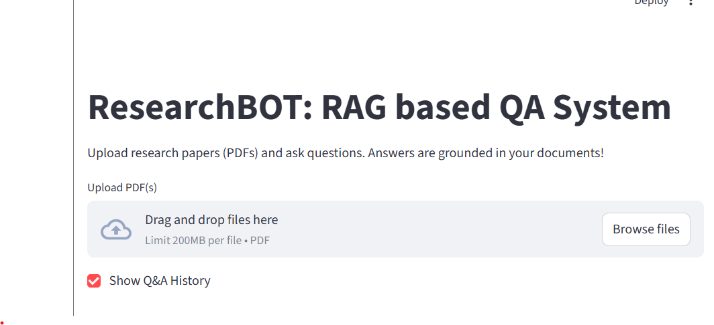

# 📚 ResearchBot – AI-Powered Research Assistant

  

  <b>Transforming research papers into actionable insights using Large Language Models (LLMs) and Retrieval-Augmented Generation (RAG).</b>

  
  
  
  
  

---

## 🚩 Problem Statement

Researchers and students struggle to extract relevant insights from large volumes of research papers. Manual reading and summarization are:

- ⏱️ Time-consuming  
- ❌ Error-prone  
- 📉 Inefficient for cross-paper comparison  

As datasets grow, answering specific research questions becomes increasingly difficult.

---

## 💡 Solution

**ResearchBot** is an AI-powered research assistant that enables **context-aware question answering** over PDF documents using **RAG (Retrieval-Augmented Generation)**.

Users can upload multiple PDFs and interact with them conversationally while ensuring answers are **grounded in source documents**.

---

---

## ⚙️ Key Functionalities

### 1️⃣ PDF Upload & Processing
- Supports uploading multiple PDF documents  
- Text extraction using **pdfplumber** and **PyPDF2**  
- Handles academic and research-style PDFs  

---

### 2️⃣ Text Chunking
- Uses **RecursiveCharacterTextSplitter** from LangChain  
- Ensures optimal chunk size and overlap  
- Improves semantic search accuracy  

---

### 3️⃣ Vector Database Indexing
- Uses **FAISS** for high-performance similarity search  
- Stores dense embeddings of text chunks  
- Enables fast retrieval of relevant document sections  

---

### 4️⃣ RAG-Based Question Answering
- Retrieves top-k relevant chunks from FAISS  
- Builds summarized context from retrieved chunks  
- Generates answers using an LLM constrained to retrieved context  
- Ensures answers are grounded and reference-based  

---

### 5️⃣ Embeddings & LLM Integration
- **Embedding Model:**  
  - `sentence-transformers/all-MiniLM-L6-v2` (Hugging Face)  
- **Large Language Model:**  
  - `mistralai/Mistral-7B-Instruct-v0.2`  
  - Accessed via Hugging Face Inference API  
- Secure token-based authentication  

---

### 6️⃣ Interactive Streamlit Interface
- Upload PDFs and index them with a single click  
- Ask research questions in natural language  
- View generated answers instantly  
- Expandable section to view summarized context  

---

### 7️⃣ Modular & Production-Ready Architecture
- Clear separation of concerns:
  - PDF ingestion  
  - Chunking & embeddings  
  - FAISS indexing  
  - RAG answer generation  
  - UI layer  
- Easy to extend with new models or vector databases  

---

## 🧰 Tech Stack

### 🔹 Programming Language
- **Python**

### 🔹 Frontend / UI
- **Streamlit**

### 🔹 PDF Processing
- pdfplumber  
- PyPDF2  

### 🔹 Text Processing
- LangChain  
- langchain-community  
- LangChain Text Splitters  

### 🔹 Embeddings
- Hugging Face Sentence Transformers  
- Model: `all-MiniLM-L6-v2`

### 🔹 Vector Database
- FAISS (CPU)

### 🔹 Large Language Model
- Mistral-7B-Instruct-v0.2  
- Hugging Face Inference API  

### 🔹 Supporting Libraries
- sentence-transformers  
- transformers  
- huggingface-hub  
- python-dotenv  
- pyngrok (for Streamlit tunneling in Colab)  

---

## 🚀 Deployment & Execution

- ✅ Local machine  
- ✅ Google Colab (GPU-supported)  
- ✅ Cloud-ready (Docker / VM compatible)  

---

## 📌 Features at a Glance

- Multi-PDF ingestion  
- Semantic search with FAISS  
- Context-grounded answers  
- Citation-aware summarization  
- Clean and modern UI  
- Secure API token handling  

---

## 🎯 Use Cases

- Academic research assistance  
- Literature review automation  
- Exam and thesis preparation  
- Paper comparison and analysis  
- Knowledge extraction from technical PDFs  

---

## 🔮 Future Enhancements

- Support for more file formats (DOCX, TXT)  
- Persistent vector storage across sessions  
- Source highlighting in original PDFs  
- Chat history and memory  
- Deployment on Hugging Face Spaces  

---

## 👤 Author

**Jahanvi Gupta**

- GitHub: https://github.com/JahanviGupta17  
- Project: ResearchBot – RAG-based QA System  

> **ResearchBot** — Making research faster, smarter, and more accessible with AI.

